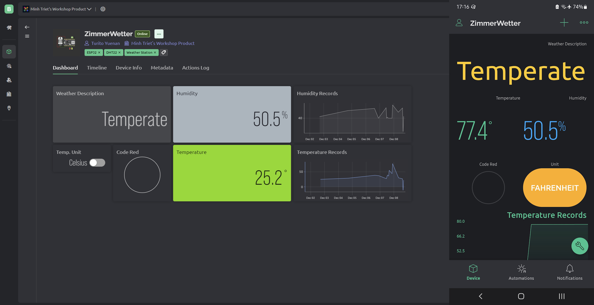

# ZimmerWetter - Reliable, Self-Sufficient Weather Station

> This is a legacy university workshop project

ZimmerWetter (German for "Room Weather") is an IoT project for setting up a weather station of your own. With simple components, you'll be able to know the specific weather of your own home/workplace without the need of an external weather provider!

## Usage

- Within [Blynk](https://blynk.cloud), setup a new device.
- Copy `secrets.example.h` and rename the copied file as `secrets.h`.
- Edit the secrets file to your preferences.
- Load the files `esp32-c3.ino`, `secrets.h`, `libraries.txt` and `diagram.json` into a Wokwi project.
- To use in-real-life, connect an ESP32-C3 board wired to a DHT22 sensor and an LED, then upload the file [sketch.ino](./esp32-c3.ino) in Arduino IDE/CLI.

## Tech stack

- Frontend: Blynk
- Simulation: Wokwi
- Libraries: See [the library file](libraries.txt)
- Hardware: ESP32 microcontroller, DHT22 sensor, LEDs & wires

## Gallery

### User Interface

### Hardware

